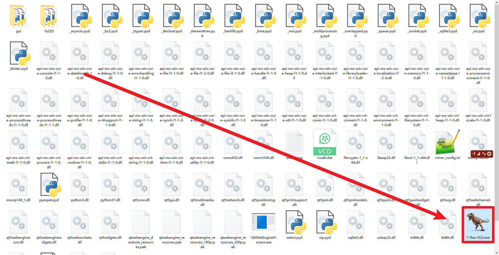
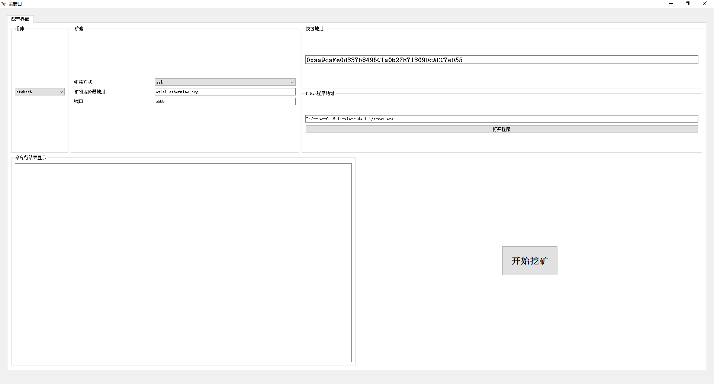
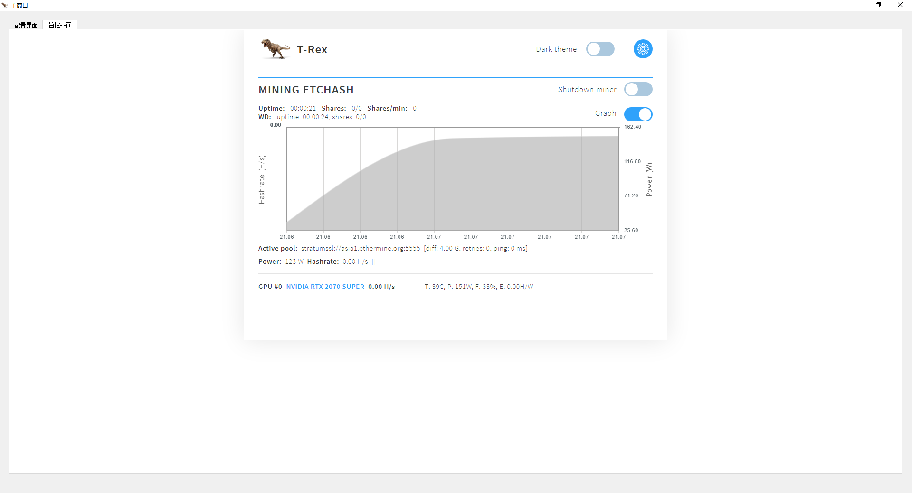
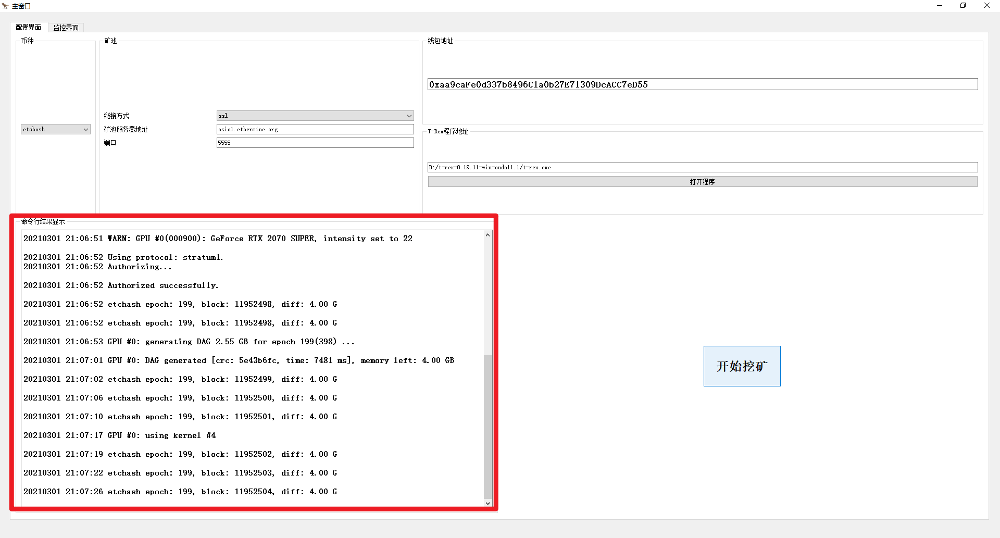

# 挖矿GUI界面使用教程
-------------------
## 下载T-Rex挖矿程序

-------------------------------------------------------
首先在https://github.com/trexminer/T-Rex 下载T-Rex挖矿程序。

## 下载GUI程序

然后在本仓库下载打包的程序：T-Rex-GUI.zip

**打开GUI软件**

## 设置参数

设置挖的币种，矿池服务器信息，自己的钱包地址，挖矿软件位置

### 具体如何知晓这些参数，可以查看[挖矿新手向教程，两步开挖以太坊](https://www.bilibili.com/video/BV1GN41197iy?p=2)

## 点击按钮-开始挖矿

然后软件自动打开监控页面，命令行显示在首页左下角

